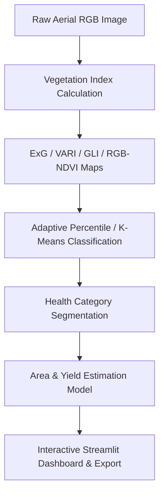

# UAV Yield & Crop Health Monitoring System

> Academic Prototype for UAV RGB-based Crop Health Assessment and Yield Estimation.

[Repository](https://github.com/SanyogSingh07/crop-yield-monitoring-)

---

## Overview

The **UAV Yield & Crop Health Monitoring System** is a computer vision and remote sensing application developed in Python and Streamlit. It enables precision agricultural analysis directly from standard top-down (nadir) RGB aerial imagery captured by unmanned aerial vehicles (UAVs) without requiring expensive Near-Infrared (NIR) sensors.

---

## Problem Statement

Traditional agricultural monitoring relies on ground sampling or expensive multi-spectral imagery (NIR/RedEdge). Standard RGB UAV cameras are widely accessible, but extracting actionable crop health indicators requires specialized vegetation index transformations and adaptive statistical thresholding.

---

## Solution & Architecture

The application implements a multi-stage image processing pipeline:



### Core Features & Technical Highlights
- **Spectral Vegetation Indices**:
  - **ExG (Excess Green)**: $2G - R - B$ for early-stage canopy detection.
  - **VARI (Visible Atmospherically Resistant Index)**: $(G - R) / (G + R - B)$ for atmospheric illumination robustness.
  - **GLI (Green Leaf Index)**: $(2G - R - B) / (2G + R + B)$ for normalized leaf coverage.
  - **RGB-NDVI**: $(G - R) / (G + R)$ for pseudo-NDVI approximation.
- **Classification Engine**:
  - **Adaptive Percentile Thresholding**: Dynamic image-specific quantile distribution splitting.
  - **Unsupervised K-Means Clustering**: Natural feature grouping into 3 health vigor clusters.
- **Yield Calculation Engine**: Multi-tier yield output model based on ground sample distance (GSD) and productivity rates.

---

## Tech Stack

- **Core**: Python 3.8+
- **Computer Vision**: OpenCV (`cv2`), Pillow, NumPy
- **Data Analytics & Viz**: Pandas, Plotly, Scikit-learn
- **Interface**: Streamlit

---

## Project Structure

```text
crop-yield-monitoring-/
├── app.py                      # Main Streamlit application
├── generate_test_images.py     # Test imagery generator utility
├── QUICKSTART.md               # Quick launch guide
├── requirements.txt            # Python dependencies
└── README.md
```

---

## Setup & Execution

```bash
git clone https://github.com/SanyogSingh07/crop-yield-monitoring-.git
cd crop-yield-monitoring-
python -m venv .venv
# Activate venv: Windows: .venv\Scripts\activate | Unix: source .venv/bin/activate
pip install -r requirements.txt
streamlit run app.py
```

---

## Limitations & Disclaimer

- Designed as an academic research prototype.
- Productivity coefficients require ground-truth calibration for specific crop varieties and soil conditions.

---

## License

Distributed under the **MIT License**.
